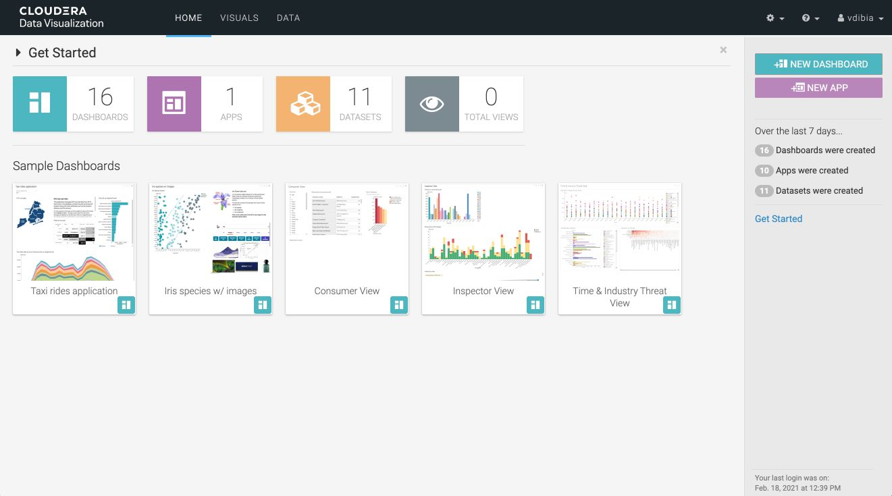

# Cloudera Data Visualization (CDV) on CML

This AMP demonstrates how to instantiate Cloudera Data Visualization on CML.

 

> CDP Data Visualization enables data engineers, business analysts, and data scientists to quickly and easily explore data, collaborate, and share insights across the data lifecycle—from data ingest to data insights and beyond. Delivered natively as part of Cloudera Data Platform (CDP), Data Visualization delivers a consistent and easy-to-use data visualization experience with intuitive and accessible drag-and-drop dashboards and custom application creation.

Data Visualization is fully secured by SDX, enabling augmented data workflows across all your data and analytic workflows. Build predictive applications from ML models served in CDP Machine Learning, or leverage your data warehouse to power fast intelligent reporting without moving data or using third-party tools.

Learn more about Cloudera Data Visualization [here](https://www.cloudera.com/products/cloudera-data-platform/data-visualization.html).

## Requirements

The following are requirements for running CDV:

- [Add a CDV engine](https://docs.cloudera.com/data-visualization/cloud/start-cml/topics/viz-add-engine-to-cml.html) to your workspace. If you do not have access, contact your site adminstrator to CDV as an engine.
- [Optional for AMPs] Set CDV as the default engine. This ensures an instantiated AMPs will use this engine.

## Launch CDV

There are a few ways to launch CDV :
- Select the CDV tile from your Catalog if available and launch!
- Create a new project, select ML prototype and provide the URL to this GIT repo.
- Create a blank project, create an application and specify the CDV launch script `/opt/vizapps/tools/arcviz/startup_app.py`.

